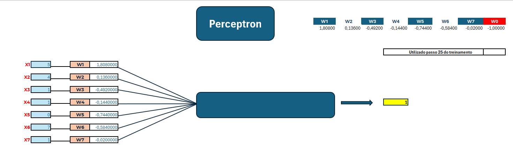

# Modelo de Perceptron
 

O **Perceptron** é o algoritmo de aprendizado supervisionado mais simples utilizado para classificação de padrões binários.  
Ele serve como a unidade fundamental (neurônio artificial) de uma rede neural e simula a forma como um neurônio biológico processa informações, combinando sinais de entrada para tomar uma decisão.

---

## 1. Estrutura e Componentes do Modelo

O modelo é composto por quatro elementos principais:

* **Sinais de Entrada ($X_1$ a $X_7$):** Dados numéricos que representam as características do problema analisado.
* **Pesos ($W_1$ a $W_7$):** Parâmetros que determinam a importância ou o peso de cada entrada na decisão final da rede.
* **Viés ($W_0$):** Um peso especial de limiar de ativação do neurônio (fixado em $-1,0$ na estrutura do modelo).
* **Saída:** O resultado final gerado a partir da soma ponderada das entradas multiplicadas pelos pesos.

---

## 2. Funcionamento do Treinamento

O treinamento do Perceptron ocorre de forma iterativa ao longo de vários passos (ou épocas) para ajustar os parâmetros da rede:

1. **Cálculo da Soma Ponderada:** Para cada amostra, o algoritmo multiplica cada entrada pelo seu peso correspondente e adiciona o viés: 
$$\text{Soma} = \sum_{i=1}^{7} (X_i \cdot W_i) + W_0$$

2. **Função de Ativação:** O valor da soma é avaliado. Se o resultado for maior ou igual a zero, a rede emite a saída $1$; caso contrário, emite a saída $-1$ (ou $0$, dependendo da convenção de classes).

3. **Correção do Erro:** Caso a predição da rede seja diferente do valor desejado (alvo), o erro é calculado e o algoritmo altera os pesos e o viés utilizando a taxa de aprendizado (como $0,1$) para a próxima iteração.

---

## 3. Estrutura e Explicação das Abas

A planilha é dividida em três abas principais, cada uma com uma função específica dentro do ciclo do projeto:

### Aba "Neurônio"
* **Função:** Painel de inferência e visualização do estado atual do neurônio.
* **Componentes:** Apresenta o conjunto de 7 entradas ($X_1$ a $X_7$) e os respectivos pesos ($W_1$ a $W_7$ e $W_0$).
* **Uso:** Simula a tomada de decisão da rede e calcula a saída final a partir do passo 25.

### Aba "Treinamento"
* **Função:** Registra o histórico e a evolução das etapas de aprendizado ao longo dos exemplos.
* **Componentes:** Lista amostra por amostra, os valores de entrada, a saída desejada (alvo) e os valores de saída obtidos pelo modelo.
* **Uso:** Contém os parâmetros de configuração e o cálculo de erro e delta que atualiza os pesos.

### Aba "Passo 25 Utilizado"
* **Função:** Congela os pesos da rede exatamente no passo 25 do treinamento.
* **Componentes:** Mostra os valores específicos de $W_1$ a $W_0$ alcançados na vigésima quinta iteração.
* **Uso:** Funciona como o estado validado e treinado do modelo para inferências.

